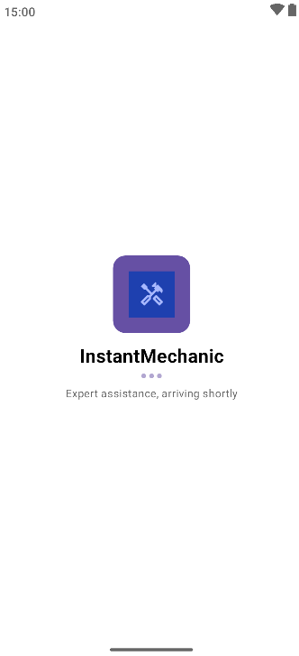
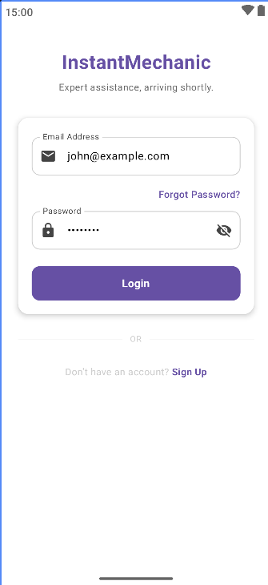
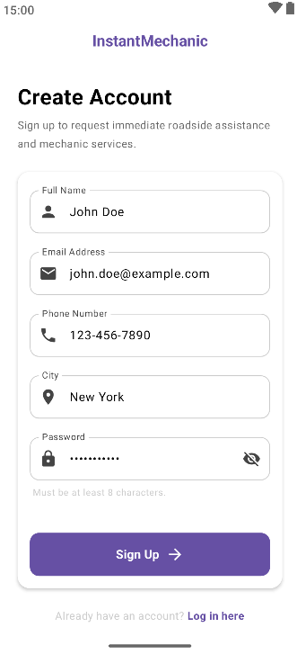
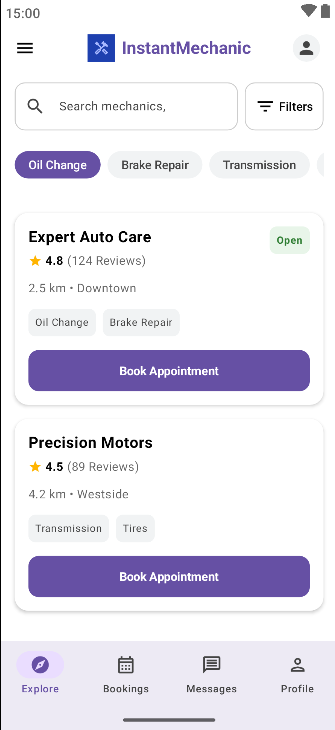
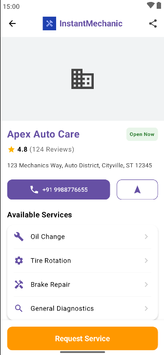
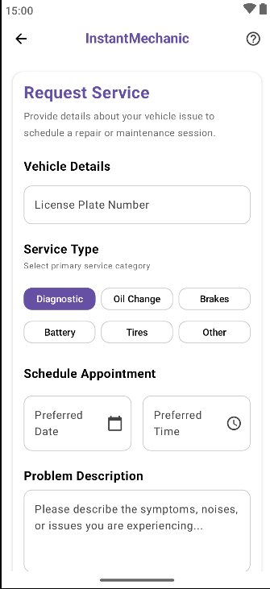
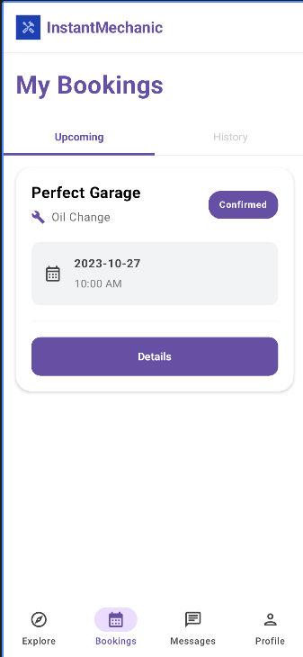
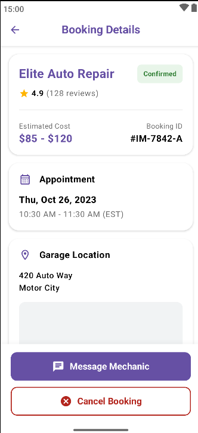
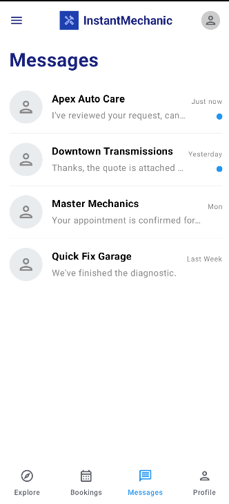
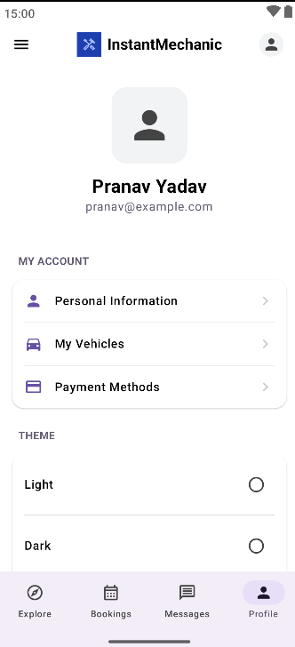

# 🚗 InstantMechanic

An Android application that enables users to discover nearby mechanics, request roadside services, manage bookings, and communicate with garages through a modern and intuitive user interface built entirely with Jetpack Compose.

---

# 📹 Demo Video

<div align="center">
  <video src="media/instantmechanix.mp4" width="320" height="640" controls></video>
</div>

---

# 📱 Application Screens

| Splash | Login |
|---------|-------|
|  |  |

| Signup | Home |
|---------|------|
|  |  |

| Garage Details | Request Service |
|----------------|----------------|
|  |  |

| Bookings | Booking Details |
|-----------|----------------|
|  |  |

| Messages | Profile |
|-----------|----------|
|  |  |

---

# 📖 About the Project

InstantMechanic is a modern Android application developed using **Kotlin**, **Jetpack Compose**, and **MVVM Architecture**. The application allows users to browse nearby mechanics, explore garage details, request vehicle servicing, manage service bookings, and communicate with mechanics from a unified interface.

The project follows Android development best practices with proper separation of concerns using MVVM, Repository Pattern, Hilt Dependency Injection, StateFlow, and Material Design 3.

---

# ✨ Features

## Authentication
- **Splash Screen**: Initial entry with session check.
- **Login/Signup**: Secure authentication flows with input validation.

## discovery
- **Home**: View nearby mechanics, search by name, and filter by services (Oil Change, Brake Repair, etc.).
- **Garage Details**: Comprehensive information including ratings, distance, working hours, and available services.

## Service Management
- **Request Service**: Easy-to-use form to describe vehicle issues and book appointments.
- **My Bookings**: Track upcoming and past service requests with real-time status updates.
- **Booking Details**: Full summary of scheduled services and garage info.

## Communication & Personalization
- **Messages**: Direct real-time chat with mechanics and garages.
- **Profile**: Manage personal details, vehicle information, and app settings.

---

# 🏗️ Project Architecture

The application follows the **MVVM (Model–View–ViewModel)** architecture.

```
UI (Jetpack Compose)
│
▼
ViewModel (UI State Management)
│
▼
Repository (Single Source of Truth)
│
├────────── Remote Data Source (Retrofit)
│
└────────── Local Data Source (Mock Data / DataStore)
```

---

# 📂 Project Structure

```
com.example.instantmechanicassignment

├── data
│   ├── api          # Retrofit API definitions
│   ├── model        # Domain and Data models
│   ├── repository   # Data handling and business logic
│   └── mock         # High-fidelity mock data providers
│
├── presentation     # Feature-based UI (Jetpack Compose)
│   ├── splash       # Entry screen
│   ├── login        # Authentication
│   ├── signup       # Registration
│   ├── home         # discovery and Filtering
│   ├── detail       # Garage/Mechanic Information
│   ├── request      # Service Booking Flow
│   ├── bookings     # Management of Services
│   ├── messages     # Chat and Communication
│   └── profile      # User settings
│
├── di               # Hilt Dependency Injection modules
├── navigation       # Compose Navigation setup
└── utils            # Extensions and Helpers
```

---

# 🧱 Technology Stack

| Category | Technology |
|-----------|------------|
| Language | Kotlin |
| UI Framework | **Jetpack Compose** |
| Design System | Material Design 3 |
| Architecture | MVVM + Repository Pattern |
| Dependency Injection | Hilt |
| Networking | Retrofit |
| Async/Reactive | Coroutines & StateFlow |
| Image Loading | Coil |
| Local Storage | DataStore Preferences |
| IDE | Android Studio (Ladybug) |

---

# 🚀 Running the Project

1. **Clone the Repository**:
   ```bash
   git clone https://github.com/pranav50227/InstantMechanicAssignment.git
   ```
2. **Open in Android Studio**: Ensure you are using Android Studio Ladybug or newer for full Compose support.
3. **Sync Gradle**: Allow the project to download all necessary dependencies.
4. **Run**: Deploy the app to an emulator or physical device (API 24+ recommended).

---

# 👨‍💻 Developed By

**Pranav**

Android Developer

GitHub: [pranav50227](https://github.com/pranav50227)  
LinkedIn: [pranav50227](https://linkedin.com/in/pranav50227)

---

# 📄 License

This project has been developed as part of an **Android Development Assignment** for evaluation purposes.
